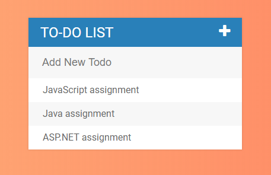

<h1>ToDoList Application</h1>

This application is created with HMML5, CSS3, jQuery, Google Fonts - 'Roboto' and Font Awesome library.

This app allows the user to track records to add, check, and delete Todos

Project Link: <a href="https://todo-list-project.netlify.com/">https://todo-list-project.netlify.com/</a>

Font Awesome library for icons: <a href="https://fontawesome.com/">https://fontawesome.com/</a>

